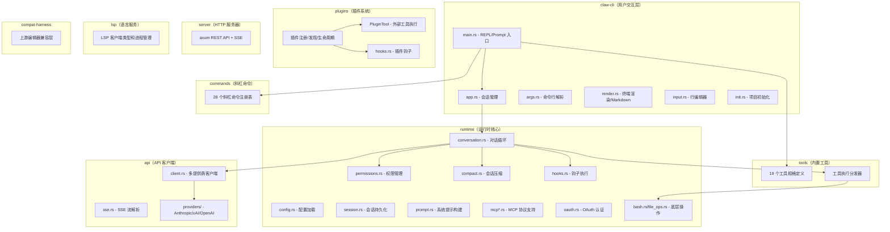
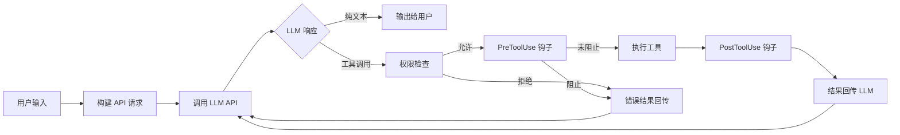

# Claw Code 项目完整中文文档

## 一、项目概述

### 1.1 项目定位

**Claw Code** 是一个本地编码代理（Coding Agent）CLI 工具，灵感来源于 Claude Code，但采用 **全安全 Rust（Safe Rust）** 进行 **洁净室（Clean-Room）重写**，即不是直接移植或复制，而是从零开始设计实现。

该项目的核心目标是提供一个：
- 🤖 **本地 AI 编码助手**：通过终端与 LLM（大语言模型）交互，辅助代码编写、调试和分析
- 🛠️ **工作区感知的工具链**：内置文件操作、搜索、Shell 执行、Web 抓取等丰富工具
- 🔌 **可扩展的插件系统**：支持自定义工具、钩子和命令
- 🌐 **多 LLM 提供商支持**：支持 Anthropic（Claude）、xAI（Grok）、OpenAI 等模型

### 1.2 项目背景

> 2026 年 3 月 31 日凌晨 4 点，Claude Code 原始源码被泄露，这引发了整个开发社区的巨大关注。项目作者 Sigrid Jin（华尔街日报报道的 AI 重度用户，去年单独消耗了 250 亿 Claude Code token）决定对核心功能进行洁净室重写——先用 Python，后扩展为 Rust。

### 1.3 项目历史

| 里程碑 | 说明 |
|--------|------|
| 初始 Python 重写 | 使用 oh-my-codex (OmX) 在凌晨完成 |
| Rust 移植 | 当前主力实现，更快、内存安全 |
| v0.1.0 | 首个公开发布里程碑，源码编译分发 |

### 1.4 当前版本状态

- **版本号**：`0.1.0`
- **发布阶段**：初始公开发布，仅支持源码编译
- **平台重点**：macOS 和 Linux（Windows 就绪性尚未确认）
- **功能完整度**：核心功能可用，但尚未与原始 TypeScript CLI 达到完全功能对等

---

## 二、仓库目录结构

```text
claw-code-main/
├── .github/                    # GitHub 配置（赞助等）
├── assets/                     # 截图、图片等静态资源
│   └── omx/                    # OmX 工作流截图
├── rust/                       # ★ Rust 工作空间（主实现）
│   ├── Cargo.toml              # 工作空间根配置
│   ├── Cargo.lock              # 依赖锁定文件
│   ├── crates/                 # 所有 Rust crate
│   │   ├── api/                # API 客户端（Anthropic/xAI/OpenAI）
│   │   ├── claw-cli/           # CLI 二进制（REPL/渲染/初始化）
│   │   ├── commands/           # 斜杠命令注册表
│   │   ├── compat-harness/     # 上游编辑器兼容层
│   │   ├── lsp/                # LSP 语言服务协议支持
│   │   ├── plugins/            # 插件系统（发现/注册/生命周期）
│   │   ├── runtime/            # 运行时核心（会话/配置/MCP/工具）
│   │   ├── server/             # HTTP/SSE 服务器（axum）
│   │   └── tools/              # 内置工具定义和执行
│   ├── docs/                   # 发布文档
│   └── CONTRIBUTING.md         # 贡献指南
├── src/                        # Python 移植验证工作区
│   ├── main.py                 # CLI 入口
│   ├── models.py               # 数据模型
│   ├── commands.py             # 命令移植元数据
│   ├── tools.py                # 工具移植元数据
│   ├── query_engine.py         # 移植摘要引擎
│   ├── runtime.py              # 运行时仿真
│   ├── parity_audit.py         # 对等性审计
│   └── ...（30+ 子目录和模块）
├── tests/                      # Python 验证测试
├── CLAUDE.md                   # Claude Code 仓库引导文件
├── CLAW.md                     # Claw Code 仓库引导文件
├── PARITY.md                   # TypeScript 对等性差距分析
└── README.md                   # 项目主 README
```

---

## 三、Rust 工作空间详细架构

Rust 工作空间是项目的 **核心产品实现**，采用 Cargo Workspace 组织，包含 **9 个 crate**。

### 3.1 架构概览图



### 3.2 各 Crate 详解

---

#### 3.2.1 `claw-cli`（CLI 二进制 — 用户入口）

| 文件 | 大小 | 职责 |
|------|------|------|
| `main.rs` | 175KB | 主程序入口，REPL 循环，流式响应处理，所有斜杠命令分发 |
| `app.rs` | 12KB | `CliApp` 会话管理器，处理用户输入，调度斜杠命令和对话请求 |
| `args.rs` | 2.7KB | Clap 命令行参数定义（模型、权限、配置、输出格式） |
| `render.rs` | 25KB | 终端 Markdown 渲染、Spinner 动画、颜色主题 |
| `input.rs` | 37KB | 自定义行编辑器，支持多行输入（Shift+Enter 换行） |
| `init.rs` | 15KB | `/init` 命令实现，生成 `CLAW.md` 项目引导文件 |

**核心功能**：
- **交互式 REPL**：启动后进入交互模式，支持多行输入、Tab 补全
- **一次性 Prompt**：`claw prompt "你的问题"` 非交互执行
- **流式输出**：实时显示 LLM 回复，带 Spinner 动画
- **多输出格式**：Text / JSON / NDJSON

**命令行参数**：
```
claw-cli [OPTIONS] [COMMAND]

选项：
  --model <MODEL>                模型名（默认: claude-opus-4-6）
  --permission-mode <MODE>       权限模式（read-only / workspace-write / danger-full-access）
  --config <PATH>                配置文件路径
  --output-format <FORMAT>       输出格式（text / json / ndjson）

子命令：
  prompt <text>     运行一次性提示并退出
  login             OAuth 登录
  logout            清除 OAuth 凭证
  dump-manifests    打印清单信息
  bootstrap-plan    打印启动计划
```

---

#### 3.2.2 `api`（API 客户端 — LLM 通信层）

| 文件 | 大小 | 职责 |
|------|------|------|
| `client.rs` | 4.3KB | 多提供商统一客户端 `ProviderClient`（枚举分发） |
| `error.rs` | 4KB | API 错误类型定义 |
| `sse.rs` | 8.8KB | Server-Sent Events 流解析器 |
| `types.rs` | 5.8KB | 消息请求/响应/流事件类型定义 |
| `providers/mod.rs` | 6.9KB | 提供商检测、模型别名解析 |
| `providers/claw_provider.rs` | 35KB | Anthropic API 客户端（含 OAuth 支持） |
| `providers/openai_compat.rs` | 32KB | OpenAI 兼容客户端（支持 xAI/OpenAI） |

**支持的模型提供商**：

| 提供商 | 模型别名 | API Key 环境变量 | Base URL 环境变量 |
|--------|----------|-----------------|-------------------|
| Anthropic (Claude) | `opus`, `sonnet`, `haiku` | `ANTHROPIC_API_KEY` | `ANTHROPIC_BASE_URL` |
| xAI (Grok) | `grok`, `grok-mini` | `XAI_API_KEY` | `XAI_BASE_URL` |
| OpenAI | `gpt-4o` 等 | `OPENAI_API_KEY` | `OPENAI_BASE_URL` |

**别名解析示例**：
- `opus` → `claude-opus-4-6`
- `grok` → `grok-3`
- `grok-mini` → `grok-3-mini`

---

#### 3.2.3 `runtime`（运行时核心 — 大脑）

这是整个项目最核心的 crate，包含 **20 个模块**，负责所有运行时逻辑。

| 模块 | 大小 | 职责 |
|------|------|------|
| `conversation.rs` | 26KB | **核心对话循环**：用户输入 → API 调用 → 工具执行 → 结果回传 |
| `config.rs` | 40KB | 配置加载与合并（CLAW.md、.claw.json、MCP 配置） |
| `prompt.rs` | 28KB | 系统提示构建器（工作区感知、OS 感知、指令文件） |
| `compact.rs` | 23KB | 会话压缩（Token 估算、历史消息裁剪） |
| `session.rs` | 13KB | 会话持久化（消息存储、序列化/反序列化） |
| `mcp_stdio.rs` | 62KB | MCP 协议 stdio 传输实现（JSON-RPC 通信） |
| `oauth.rs` | 19KB | OAuth 2.0 PKCE 认证流程 |
| `file_ops.rs` | 17KB | 文件读写、编辑、glob/grep 搜索 |
| `permissions.rs` | 7KB | 三级权限模型（ReadOnly / WorkspaceWrite / DangerFullAccess） |
| `hooks.rs` | 10KB | PreToolUse / PostToolUse 钩子执行引擎 |
| `bash.rs` | 9.9KB | Shell 命令执行（含超时和后台运行） |
| `remote.rs` | 12KB | 上游代理和远程会话支持 |
| `sandbox.rs` | 11KB | 沙箱安全执行环境 |
| `mcp.rs` | 9.6KB | MCP 配置辅助函数 |
| `mcp_client.rs` | 8.4KB | MCP 客户端传输抽象 |
| `usage.rs` | 10KB | Token 使用量跟踪和费用估算 |
| `json.rs` | 10KB | JSON 处理工具 |
| `bootstrap.rs` | 1.5KB | 启动引导阶段定义 |
| `sse.rs` | 3.5KB | SSE 运行时辅助 |
| `lib.rs` | 4KB | 模块导出 |

**核心对话循环（`ConversationRuntime`）**：



**三级权限模型**：

| 权限级别 | 说明 | 允许的工具 |
|----------|------|-----------|
| `ReadOnly` | 只读 | 文件读取、搜索、Web 抓取 |
| `WorkspaceWrite` | 工作区写入 | 文件写入/编辑、Todo、配置 |
| `DangerFullAccess` | 完全访问 | Shell 执行、Agent、REPL |

---

#### 3.2.4 `tools`（内置工具 — 19 个）

所有工具通过 `mvp_tool_specs()` 注册，通过 `execute_tool()` 统一分发。

| 工具名 | 权限 | 功能说明 |
|--------|------|---------|
| `bash` | DangerFullAccess | 在当前工作区执行 Shell 命令 |
| `read_file` | ReadOnly | 读取文本文件（支持偏移和限制行数） |
| `write_file` | WorkspaceWrite | 写入文件 |
| `edit_file` | WorkspaceWrite | 替换文件中的文本（精确匹配） |
| `glob_search` | ReadOnly | 按 glob 模式搜索文件 |
| `grep_search` | ReadOnly | 按正则表达式搜索文件内容 |
| `WebFetch` | ReadOnly | 抓取 URL 内容并转为文本 |
| `WebSearch` | ReadOnly | 搜索网页获取实时信息 |
| `TodoWrite` | WorkspaceWrite | 更新当前会话的结构化任务列表 |
| `Skill` | ReadOnly | 加载本地技能定义（SKILL.md） |
| `Agent` | DangerFullAccess | 启动专用子代理任务 |
| `ToolSearch` | ReadOnly | 按关键词搜索工具 |
| `NotebookEdit` | WorkspaceWrite | 编辑 Jupyter Notebook 单元格 |
| `Sleep` | ReadOnly | 等待指定时长 |
| `SendUserMessage` | ReadOnly | 向用户发送消息 |
| `Config` | WorkspaceWrite | 获取/设置配置项 |
| `StructuredOutput` | ReadOnly | 返回结构化输出 |
| `REPL` | DangerFullAccess | 在子进程中执行代码 |
| `PowerShell` | DangerFullAccess | 执行 PowerShell 命令 |

此外，通过 `GlobalToolRegistry` 支持 **插件工具** 的动态注册。

---

#### 3.2.5 `commands`（斜杠命令 — 28 个）

按类别分组的完整斜杠命令表：

**核心流程**：
| 命令 | 说明 |
|------|------|
| `/help` | 显示可用命令 |
| `/status` | 显示当前会话状态 |
| `/compact` | 压缩会话历史以节省 Token |
| `/model [name]` | 查看/切换当前模型 |
| `/permissions [mode]` | 查看/切换权限模式 |
| `/cost` | 显示累计 Token 使用量 |

**工作区与记忆**：
| 命令 | 说明 |
|------|------|
| `/config [section]` | 检查配置（env/hooks/model/plugins） |
| `/memory` | 查看已加载的指令记忆文件 |
| `/init` | 为当前仓库创建 CLAW.md |
| `/diff` | 显示当前工作区的 git diff |
| `/version` | 显示 CLI 版本信息 |
| `/teleport <target>` | 跳转到文件或符号 |

**会话与输出**：
| 命令 | 说明 |
|------|------|
| `/clear [--confirm]` | 清空当前会话 |
| `/resume <path>` | 恢复保存的会话 |
| `/export [file]` | 导出当前对话 |
| `/session [action]` | 管理本地会话 |

**Git 与 GitHub**：
| 命令 | 说明 |
|------|------|
| `/branch [action]` | 管理 git 分支 |
| `/worktree [action]` | 管理 git worktree |
| `/commit` | 生成提交信息并创建 git commit |
| `/commit-push-pr` | 提交、推送并创建 PR |
| `/pr [context]` | 创建 Pull Request |
| `/issue [context]` | 创建 GitHub Issue |

**自动化与发现**：
| 命令 | 说明 |
|------|------|
| `/bughunter [scope]` | 自动检查代码中的 Bug |
| `/ultraplan [task]` | 深度多步推理规划 |
| `/debug-tool-call` | 调试最近的工具调用 |
| `/plugin [action]` | 管理插件（list/install/enable/disable/uninstall/update） |
| `/agents` | 列出已配置的 Agent |
| `/skills` | 列出可用技能 |

---

#### 3.2.6 `plugins`（插件系统）

完整的插件生命周期管理系统，包含约 **2944 行代码**（96KB）。

**插件类型**：

| 类型 | 说明 |
|------|------|
| `Builtin` | 内置插件 |
| `Bundled` | 捆绑分发插件 |
| `External` | 外部安装插件（本地路径或 Git URL） |

**插件清单格式**（`plugin.json`）：
```json
{
  "name": "my-plugin",
  "version": "1.0.0",
  "description": "插件描述",
  "permissions": ["read", "write", "execute"],
  "defaultEnabled": true,
  "hooks": {
    "PreToolUse": ["脚本命令"],
    "PostToolUse": ["脚本命令"]
  },
  "lifecycle": {
    "Init": ["初始化命令"],
    "Shutdown": ["关闭命令"]
  },
  "tools": [{
    "name": "工具名",
    "description": "工具描述",
    "inputSchema": {},
    "command": "执行命令",
    "requiredPermission": "read-only"
  }],
  "commands": [{
    "name": "命令名",
    "description": "命令描述",
    "command": "执行命令"
  }]
}
```

**插件管理操作**：
- `PluginManager::install(path)` — 安装插件
- `PluginManager::uninstall(id)` — 卸载插件
- `PluginManager::enable(id)` / `disable(id)` — 启停插件
- `PluginManager::update(id)` — 更新插件
- `PluginRegistry::aggregated_hooks()` — 聚合所有已启用插件的钩子
- `PluginRegistry::aggregated_tools()` — 聚合所有已启用插件的工具

---

#### 3.2.7 `server`（HTTP/SSE 服务器）

基于 **axum** 框架构建的 REST API 服务器，支持 **SSE（Server-Sent Events）** 实时推送。

**API 端点**：

| 方法 | 路径 | 功能 |
|------|------|------|
| `POST` | `/sessions` | 创建新会话 |
| `GET` | `/sessions` | 列出所有会话 |
| `GET` | `/sessions/{id}` | 获取会话详情 |
| `POST` | `/sessions/{id}/message` | 向会话发送消息 |
| `GET` | `/sessions/{id}/events` | SSE 订阅会话事件流 |

---

#### 3.2.8 `lsp`（语言服务协议）

| 文件 | 大小 | 职责 |
|------|------|------|
| `lib.rs` | 9.7KB | LSP 类型定义和进程管理 |
| `client.rs` | 15KB | LSP 客户端实现 |
| `manager.rs` | 6.5KB | LSP 服务管理器 |
| `types.rs` | 5.6KB | 诊断、符号位置等类型 |
| `error.rs` | 2KB | 错误类型 |

**功能**：代码诊断、符号定位、工作区级别的代码分析上下文，为 AI 对话提供更丰富的代码理解。

---

#### 3.2.9 `compat-harness`（兼容层）

为上游编辑器集成提供的兼容性适配层。

---

### 3.3 Rust 工作空间配置

```toml
[workspace]
members = ["crates/*"]
resolver = "2"

[workspace.package]
version = "0.1.0"
edition = "2021"
license = "MIT"

[workspace.lints.rust]
unsafe_code = "forbid"        # ★ 禁止使用 unsafe 代码

[workspace.lints.clippy]
all = { level = "warn" }
pedantic = { level = "warn" }  # 最严格的 Clippy 级别
```

> [!IMPORTANT]
> 项目全局 **禁止 unsafe 代码**，且启用了 Clippy pedantic 级别的静态检查。

---

## 四、Python 验证工作区

`src/` 目录是 **Python 移植验证工作区**，不是运行时代码。它的作用是：

1. **对等性审计**：对比 Python 工作区与原始 TypeScript 实现的覆盖度
2. **元数据镜像**：维护命令、工具的清单数据
3. **运行时仿真**：轻量级模拟 Claw Code 的路由和任务调度

**主要 CLI 命令**：

| 命令 | 说明 |
|------|------|
| `python -m src.main summary` | 渲染移植摘要 |
| `python -m src.main manifest` | 打印工作区清单 |
| `python -m src.main parity-audit` | 运行对等性审计 |
| `python -m src.main commands` | 列出命令清单 |
| `python -m src.main tools` | 列出工具清单 |
| `python -m src.main route "prompt"` | 路由提示到命令/工具 |
| `python -m src.main turn-loop "prompt"` | 运行小型状态循环 |

---

## 五、MCP 协议支持

项目完整实现了 **Model Context Protocol (MCP)** 的客户端功能：

- **stdio 传输**：通过子进程 stdin/stdout 进行 JSON-RPC 通信（`mcp_stdio.rs`，62KB 实现）
- **远程传输**：支持 WebSocket、HTTP/SSE 等传输方式
- **MCP 工具发现**：自动发现 MCP 服务器提供的工具并注册
- **MCP 资源读取**：支持读取 MCP 服务器暴露的资源

**配置方式**（在 `.claw.json` 或 `CLAW.md` 中配置 MCP 服务器）：

支持的 MCP 服务器配置类型：
- `McpStdioServerConfig` — stdio 子进程（最常用）
- `McpRemoteServerConfig` — 远程 HTTP/SSE
- `McpWebSocketServerConfig` — WebSocket
- `McpSdkServerConfig` — SDK 集成
- `McpManagedProxyServerConfig` — 托管代理

---

## 六、与原始 TypeScript 的对等性差距

> [!WARNING]
> 根据 `PARITY.md` 的分析，Rust 移植**尚未达到与 TypeScript 原始版本的完全功能对等**。

| 功能领域 | 状态 | 说明 |
|----------|------|------|
| API 客户端 / OAuth | ✅ 核心就绪 | Anthropic、xAI、OpenAI 基础支持 |
| 对话循环 / 工具调用 | ✅ 核心就绪 | 强核心循环，缺少编排层 |
| MCP 支持 | ✅ 核心就绪 | stdio 引导和客户端支持 |
| 会话持久化 | ✅ 核心就绪 | 保存和恢复功能 |
| 内置工具集 | ⚠️ 部分 | MVP 级别，缺少多个 TS 工具 |
| 钩子系统 | ⚠️ 仅配置 | 已解析配置但运行时执行有限 |
| 插件系统 | ⚠️ 基础框架 | 注册/生命周期已有，运行时集成不完整 |
| CLI 命令 | ⚠️ 功能较窄 | 15→28 个命令（TS 有更多） |
| 技能系统 | ⚠️ 仅本地 | 缺少 TS 注册表/捆绑管道 |
| 结构化/远程传输 | ❌ 缺失 | 无 TS 等效实现 |
| 服务生态 | ❌ 大部分缺失 | 分析、设置同步、策略限制等 |

---

## 七、环境要求与依赖

### 7.1 必须的环境

| 依赖 | 最低版本 | 用途 |
|------|----------|------|
| **Rust 工具链** | stable (≥ 2021 edition) | 编译 Rust 项目 |
| **Cargo** | 随 Rust 安装 | 构建管理 |
| **Git** | 任意版本 | 版本控制（部分命令需要） |
| **LLM API Key** | — | 至少需要一个提供商的 API Key |

### 7.2 可选环境

| 依赖 | 用途 |
|------|------|
| **Python 3.x** | 运行 Python 移植验证工作区 |
| **Node.js** | 某些 MCP 服务器可能需要 |

### 7.3 你的当前环境检查结果

| 检查项 | 状态 | 详情 |
|--------|------|------|
| Rust 编译器 | ✅ **已安装** | `rustc 1.94.1 (2026-03-25)` |
| Cargo | ✅ **已安装** | `cargo 1.94.1 (2026-03-24)` |
| Rust 工具链 | ✅ **已配置** | `stable-x86_64-pc-windows-msvc` (默认激活) |
| Python | ✅ **已安装** | `Python 3.11.3` |
| Git | ✅ **已安装** | `git 2.46.2.windows.1` |
| 操作系统 | ⚠️ **非主要目标** | Windows — 项目主要针对 macOS/Linux |

> [!IMPORTANT]
> **结论：你的环境基本满足编译和运行条件**，但需注意以下几点：
> 1. ✅ Rust 1.94.1 远超项目要求的 2021 edition，完全兼容
> 2. ⚠️ 项目 CI 仅覆盖 Ubuntu 和 macOS，Windows 构建"就绪性尚未确立"，可能遇到平台相关问题
> 3. ⚠️ 你需要至少一个 LLM 提供商的 API Key 才能实际使用 AI 功能

---

## 八、编译构建指南

### 8.1 编译 Rust 项目

```powershell
# 进入 Rust 工作空间
cd d:\newworkspace\claw-code-main\rust

# Debug 构建（快速编译，用于开发）
cargo build

# Release 构建（优化编译，用于使用）
cargo build --release

# 仅构建 CLI 二进制
cargo build --release -p claw-cli
```

### 8.2 运行验证

```powershell
# 格式检查
cargo fmt --all --check

# 静态分析（Clippy）
cargo clippy --workspace --all-targets -- -D warnings

# 类型检查
cargo check --workspace

# 运行所有测试
cargo test --workspace
```

### 8.3 运行 CLI

```powershell
# 查看帮助
cargo run --bin claw -- --help

# 交互式 REPL 模式（需要 API Key）
cargo run --bin claw

# 一次性提示模式
cargo run --bin claw -- prompt "总结这个工作区"

# 指定模型
cargo run --bin claw -- --model sonnet "审查最近的改动"

# 使用 release 构建
.\target\release\claw.exe
.\target\release\claw.exe prompt "解释 crates/runtime"
```

### 8.4 本地安装

```powershell
cargo install --path crates/claw-cli --locked
```

安装后可直接使用 `claw` 命令。

### 8.5 API Key 配置

```powershell
# Anthropic (Claude) — 最推荐
$env:ANTHROPIC_API_KEY = "sk-ant-..."

# xAI (Grok)
$env:XAI_API_KEY = "xai-..."

# OpenAI
$env:OPENAI_API_KEY = "sk-..."

# 或者使用 OAuth 登录
cargo run --bin claw -- login
```

### 8.6 运行 Python 验证工作区

```powershell
cd d:\newworkspace\claw-code-main

# 渲染移植摘要
python -m src.main summary

# 打印工作区清单
python -m src.main manifest

# 运行验证测试
python -m unittest discover -s tests -v
```

---

## 九、使用流程

### 9.1 首次使用

1. **设置 API Key**（选择一个提供商）：
   ```powershell
   $env:ANTHROPIC_API_KEY = "你的API密钥"
   ```

2. **编译项目**：
   ```powershell
   cd d:\newworkspace\claw-code-main\rust
   cargo build --release -p claw-cli
   ```

3. **启动交互会话**：
   ```powershell
   cargo run --bin claw
   ```

4. **在 REPL 中**：
   - 直接输入自然语言问题
   - 用 `/help` 查看所有命令
   - 用 `/status` 查看当前状态
   - 用 `/model sonnet` 切换模型
   - 用 Shift+Enter 或 Ctrl+J 换行
   - 用 Ctrl+C 取消，Ctrl+D 退出

### 9.2 典型工作流

```
你: 分析这个项目的代码结构
AI: [读取文件、搜索代码、组织分析...]

你: 修复 src/main.rs 中的 bug
AI: [读取文件、定位问题、编辑修复、验证...]

你: /diff
[显示 git 变更]

你: /commit
[生成提交信息并提交]
```

---

## 十、关键设计理念

1. **全安全 Rust**：`unsafe_code = "forbid"` — 杜绝内存安全问题
2. **严格代码质量**：Clippy pedantic + rustfmt 强制格式化
3. **模块化架构**：9 个独立 crate，依赖关系清晰
4. **多提供商抽象**：统一的 `ProviderClient` 枚举分发，轻松切换 LLM
5. **三级权限模型**：从只读到完全访问的分级安全控制
6. **插件化扩展**：工具、钩子、命令均支持插件扩展
7. **MCP 协议兼容**：标准化的工具/资源发现与执行
8. **流式处理**：SSE 流式解析，实时显示 LLM 回复

---

## 十一、总结

| 项目 | 详情 |
|------|------|
| **语言** | Rust (主实现) + Python (验证) |
| **当前版本** | 0.1.0 |
| **代码量(Rust)** | ~550KB+ 源码，9 个 crate |
| **代码量(Python)** | ~60KB+，30+ 模块 |
| **内置工具** | 19 个 |
| **斜杠命令** | 28 个 |
| **支持的 LLM** | Anthropic / xAI / OpenAI |
| **你的环境** | ✅ 可编译运行（Rust 1.94.1 + Python 3.11.3 + Git 2.46.2） |
| **注意事项** | Windows 兼容性未经官方验证；需要 API Key |
